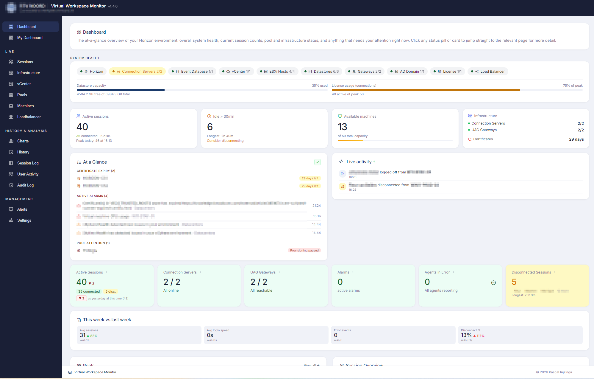
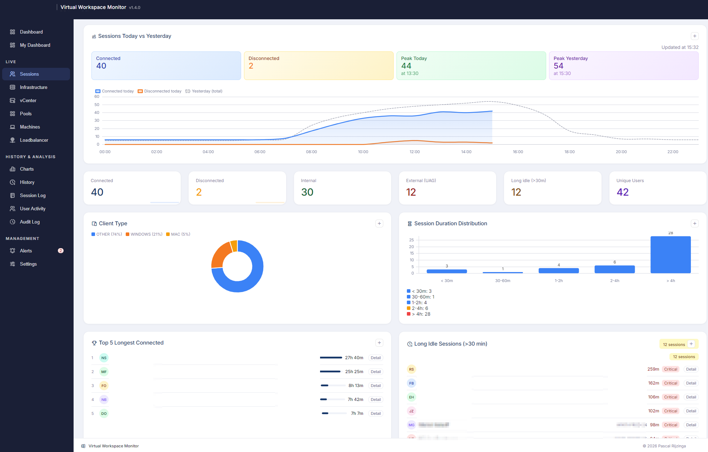
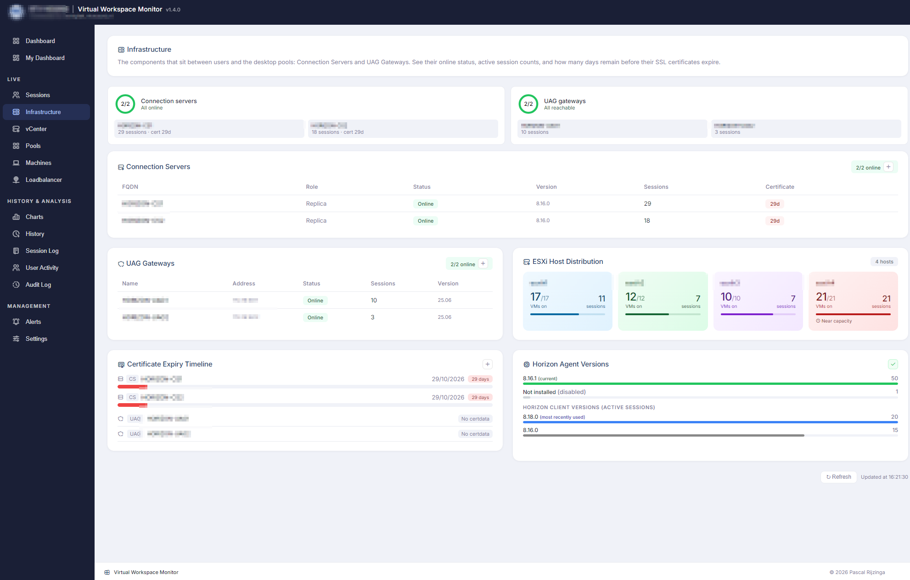
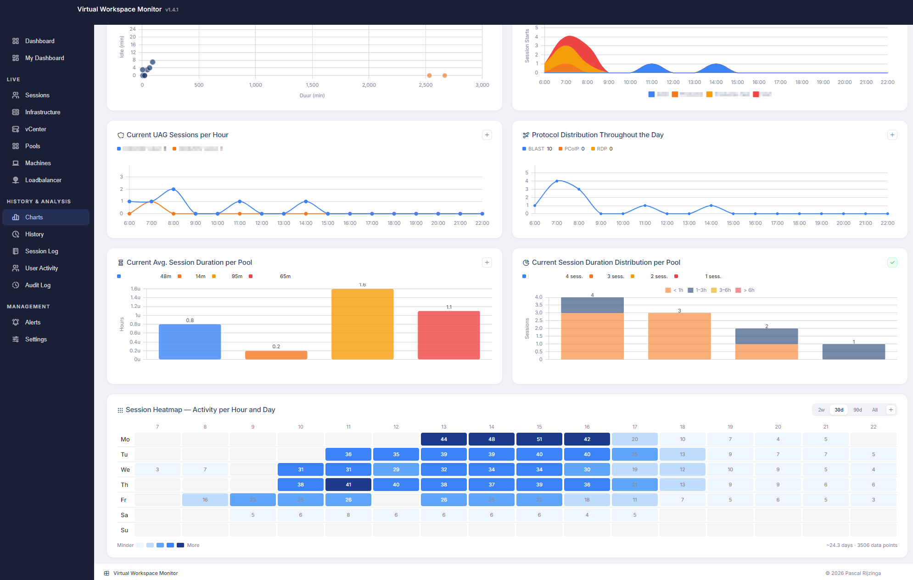

  

# Virtual Workspace Monitor

A monitoring dashboard for Omnissa Horizon (the product formerly known as VMware Horizon). One exe, one browser tab. No agents, no database server, no cloud.

I built this because Horizon Reach was discontinued and I wanted something that shows me, at a glance, what my VDI environment is doing: who is logged in, where, through which gateway, which pool is filling up, which certificate is about to expire, and whether anything needs my attention. Horizon Admin can tell you all of that, but not on one screen and not with history.

It's free to use. The source is not published — you get the binaries from the [Releases](../../releases) page. See [License](#license) at the bottom.

## What it does

**Live**
- Sessions: every desktop and application session with user, machine, pool, protocol, client, gateway route (external via UAG or internal), idle time and duration. Filter, search, click through to a user's history.
- Infrastructure: Connection Servers, UAGs, ESXi hosts, vCenter alarms, load balancer, certificate expiry, license usage.
- Pools and machines: occupancy, error and provisioning state, golden image and snapshot names, agent versions, vGPU profiles, CPU / memory / CPU-ready per machine. Restart, reset or rebuild machines from the dashboard, single or in bulk.
- GPU: NVIDIA vGPU utilisation and memory per host, with history.

**History and analysis**
- Session trends, heatmaps, today vs yesterday, peak concurrency, login speed, night sessions (split external/internal), long idle and disconnected sessions, outdated clients, top users, a recommended maintenance window based on your own usage pattern.

**Alerting and reports**
- 16 alert types (disconnected/idle thresholds, certificate expiry, host memory and vCPU pressure, datastore usage, machine and provisioning errors, pool capacity, CS/UAG down, night sessions, outdated clients, …) with e-mail and an alert history. Alerts run on the server every 60 seconds, dashboard open or not.
- Daily and weekly summary e-mails.

**The rest**
- My Dashboard: your own drag-and-drop layout of 50+ widgets, saved per user.
- Local accounts or Active Directory login (nested groups work), admin / operator / viewer roles, optional TOTP 2FA, audit log.
- Your own logo and colours, light and dark mode.

## Screenshots

| Dashboard | Sessions |
|---|---|
|  |  |

| Infrastructure | Charts |
|---|---|
|  |  |

## What you need

- **Windows** 10/11 or Server 2016+, 64-bit. Python is bundled, nothing to install.
- **Horizon 8** with the REST API enabled. I test on 2506. One Connection Server address is enough; you can add a second as fallback.
- **A Horizon account.** Read-only administrator is enough for monitoring. Restart / reset / rebuild need the matching privileges — if you don't grant them, the buttons simply don't work.
- **vCenter** (optional) for ESXi host stats, datastores, alarms and GPU. Read-only vSphere role is enough.
- **Active Directory.** Needed — Horizon only reports user SIDs and machine IDs, and the monitor resolves those to real user and machine names through LDAP. Also used for AD login and group-to-role mapping if you want that. A regular domain account is enough; it only reads.

Network: HTTPS (443) from the monitor to your Connection Servers and vCenter; HTTP on port 8383 from your browser to the monitor. The port is configurable (Settings > Connections, `listen_port` in `config.json`, or `--port 8484` on the command line) — handy if 8383 isn't allowed, or to run two environments side by side from two folders.

## Getting started

1. Download the zip from [Releases](../../releases).
2. Extract it somewhere, e.g. `C:\Virtual-Workspace-Monitor\`.
3. Run `HorizonMonitor.exe`. A console window shows the URL, something like `http://192.168.1.10:8383`.
4. Open that URL. The setup wizard asks for your Connection Server, the Horizon account and your first admin login. Everything else is optional and lives under Settings.

Keep the console window open (minimised is fine). Closing it stops the monitor.

The full manual — setup wizard, every tab, alerts, technical notes — is [here](https://skynet-projects.github.io/virtual-workspace-monitor/Virtual-Workspace-Monitor-Manual.html) (also included in every release zip).

**Updating:** stop, replace the files from the new zip, start again. Config and history stay where they are. Settings > Changelog shows what changed.

## Your data

Worth being explicit about, because a tool like this sees a lot.

- **Nothing leaves your network.** No telemetry, no update check, no phone-home, no cloud. The only outbound connections are to the Horizon, vCenter, AD and SMTP servers you configure yourself.
- **Everything is stored next to the exe** as plain JSON: `config.json`, the `horizon_*.json` history files, and a `logs\` folder (daily files, kept 14 days). Delete the folder and it's all gone.
- **Passwords are encrypted with Windows DPAPI**, bound to the Windows account running the monitor. Copying `config.json` elsewhere doesn't expose them.
- **It serves plain HTTP.** Put it on a management network, or behind a reverse proxy if you need TLS. Built-in HTTPS is on my list.
- **Login protection:** 5 failed attempts per IP in 5 minutes and that IP is blocked for a while. Optional 2FA. Session cookies are HttpOnly and SameSite=Lax.
- **Audit log:** every config change, login and machine action, with user and time.
- **Support export** (Settings > System Health) makes a zip of raw Horizon API responses for troubleshooting. It only runs when an admin clicks the button, and it masks user names, SIDs, machine/server/gateway names, IPs and DNS names before writing the zip. Look inside before you send it to anyone; it never goes anywhere by itself.

## Settings, briefly

| Tab | What's there |
|---|---|
| Connections | Horizon, vCenter, Active Directory (name resolution + login), load balancer, SMTP |
| ESXi Specs | Host hardware, used for capacity calculations |
| Thresholds & Alerts | All alert types and thresholds, night window, recipients |
| Reporting | Daily / weekly e-mails |
| Access Control | Local users, AD group → role mapping, 2FA |
| Branding | Logo, name, colours |
| License | Horizon license usage |
| Changelog | Release notes of the running version |
| System Health | Background loops, log files, support export |

Port, CORS origins and history retention are in `config.json`; the manual has the details.

## When something doesn't work

- **Login keeps bouncing you back to the login page.** Click *Having trouble signing in?* on that page. It checks whether your browser keeps cookies for this address, whether the server answers, and whether the clocks agree — and has a Copy button so you can send me the result. Nine times out of ten it's a browser security mode or a group policy blocking cookies for an IP address, or a proxy that needs an exception for the port.
- **"Port 8383 is already in use" at startup.** There's already one running (check Task Manager), or something else has the port. `listen_port` in `config.json` changes it.
- **No data, or Horizon shows red.** Check Settings > Connections and the log in `logs\`. Usually it's an account without admin rights, or the REST API being disabled on the Connection Server.
- **Users show up as SIDs, machines as IDs.** The AD connection isn't working. Check the LDAP settings and whether the account can read the domain.
- **Anything else:** grab the logs (Settings > System Health) and open an [issue](../../issues). Mention the version from the header and your Horizon version.

## What's not there yet

Things people have asked for, roughly in the order I intend to look at them: HTTPS with your own certificate, multiple vCenters, Cloud Pod Architecture (multi-pod), RDSH farms and published apps, running as a Windows service. I don't have a multi-pod or RDSH environment myself, so those depend on people who do being willing to test.

If you want something, open an issue and tell me what your environment looks like (Horizon version, pods, RDSH yes/no). No promises on timing — this is a spare-time project.

## License

Free to use, personal or commercial, on as many machines as you like. Not for resale, redistribution, modification or reverse engineering. Full text in [LICENSE](LICENSE).

Omnissa, Horizon, VMware and vSphere are trademarks of their respective owners. This is an independent project with no connection to Omnissa or Broadcom.
